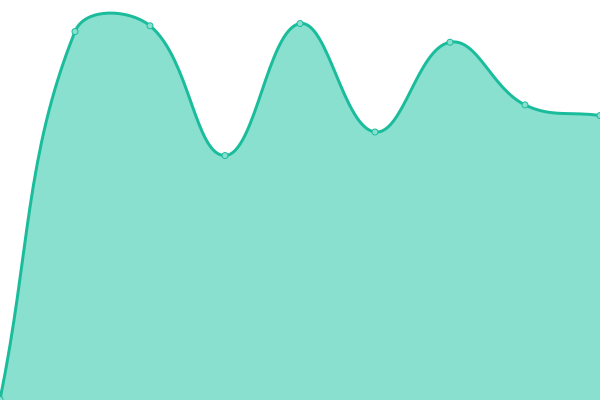

# [📈 Live Status](https://DataEnsta.github.io/upptime): <!--live status--> **🟧 Partial outage**

This repository contains the open-source uptime monitor and status page for [DaTA ENSTA](data-ensta.fr), powered by [Upptime](https://github.com/upptime/upptime).

With [Upptime](https://upptime.js.org), you can get your own unlimited and free uptime monitor and status page, powered entirely by a GitHub repository. We use [Issues](https://github.com/DataEnsta/upptime/issues) as incident reports, [Actions](https://github.com/DataEnsta/upptime/actions) as uptime monitors, and [Pages](https://DataEnsta.github.io/upptime) for the status page.

<!--start: status pages-->
<!-- This summary is generated by Upptime (https://github.com/upptime/upptime) -->
<!-- Do not edit this manually, your changes will be overwritten -->
<!-- prettier-ignore -->
| URL | Status | History | Response Time | Uptime |
| --- | ------ | ------- | ------------- | ------ |
|  [Aled](https://aled.data-ensta.fr) | 🟩 Up | [aled.yml](https://github.com/DataEnsta/upptime/commits/HEAD/history/aled.yml) | 

 1195ms
     
 | 

<a href="https://DataEnsta.github.io/upptime/history/aled">100.00%</a>
    

|  [Angry](https://angry.data-ensta.fr) | 🟥 Down | [angry.yml](https://github.com/DataEnsta/upptime/commits/HEAD/history/angry.yml) | 

 892ms
     
 | 

<a href="https://DataEnsta.github.io/upptime/history/angry">0.00%</a>
    

|  [BDE](https://bde.ensta-paris.fr) | 🟩 Up | [bde.yml](https://github.com/DataEnsta/upptime/commits/HEAD/history/bde.yml) | 

 947ms
     
 | 

<a href="https://DataEnsta.github.io/upptime/history/bde">100.00%</a>
    

|  [Bar](https://bar.data-ensta.fr) | 🟩 Up | [bar.yml](https://github.com/DataEnsta/upptime/commits/HEAD/history/bar.yml) | 

 611ms
     
 | 

<a href="https://DataEnsta.github.io/upptime/history/bar">100.00%</a>
    

|  [Bashupload](https://bashupload.data-ensta.fr) | 🟩 Up | [bashupload.yml](https://github.com/DataEnsta/upptime/commits/HEAD/history/bashupload.yml) | 

 847ms
     
 | 

<a href="https://DataEnsta.github.io/upptime/history/bashupload">100.00%</a>
    

|  [Best](https://best.data-ensta.fr) | 🟩 Up | [best.yml](https://github.com/DataEnsta/upptime/commits/HEAD/history/best.yml) | 

 591ms
     
 | 

<a href="https://DataEnsta.github.io/upptime/history/best">100.00%</a>
    

|  [Cascad](https://cascad.ensta.fr/login) | 🟩 Up | [cascad.yml](https://github.com/DataEnsta/upptime/commits/HEAD/history/cascad.yml) | 

 741ms
     
 | 

<a href="https://DataEnsta.github.io/upptime/history/cascad">100.00%</a>
    

|  [DaTA](https://data-ensta.fr) | 🟩 Up | [da-ta.yml](https://github.com/DataEnsta/upptime/commits/HEAD/history/da-ta.yml) | 

 749ms
     
 | 

<a href="https://DataEnsta.github.io/upptime/history/da-ta">100.00%</a>
    

|  [ETAl](https://etal.data-ensta.fr) | 🟩 Up | [et-al.yml](https://github.com/DataEnsta/upptime/commits/HEAD/history/et-al.yml) | 

 625ms
     
 | 

<a href="https://DataEnsta.github.io/upptime/history/et-al">100.00%</a>
    

|  [EnsTAgram](https://enstagram.data-ensta.fr) | 🟩 Up | [ens-t-agram.yml](https://github.com/DataEnsta/upptime/commits/HEAD/history/ens-t-agram.yml) | 

 876ms
     
 | 

<a href="https://DataEnsta.github.io/upptime/history/ens-t-agram">100.00%</a>
    

|  [EnsTAgram - Drive](https://enstagram-drive.data-ensta.fr) | 🟩 Up | [ens-t-agram-drive.yml](https://github.com/DataEnsta/upptime/commits/HEAD/history/ens-t-agram-drive.yml) | 

 1103ms
     
 | 

<a href="https://DataEnsta.github.io/upptime/history/ens-t-agram-drive">100.00%</a>
    

|  [EnsTAir](https://enstair.data-ensta.fr) | 🟩 Up | [ens-t-air.yml](https://github.com/DataEnsta/upptime/commits/HEAD/history/ens-t-air.yml) | 

 533ms
     
 | 

<a href="https://DataEnsta.github.io/upptime/history/ens-t-air">100.00%</a>
    

|  [EnTAblier](https://entablier.data-ensta.fr) | 🟩 Up | [en-t-ablier.yml](https://github.com/DataEnsta/upptime/commits/HEAD/history/en-t-ablier.yml) | 

 902ms
     
 | 

<a href="https://DataEnsta.github.io/upptime/history/en-t-ablier">100.00%</a>
    

|  [Flappy](https://flappy.data-ensta.fr) | 🟥 Down | [flappy.yml](https://github.com/DataEnsta/upptime/commits/HEAD/history/flappy.yml) | 

 665ms
     
 | 

<a href="https://DataEnsta.github.io/upptime/history/flappy">0.00%</a>
    

|  [GitLab](https://gitlab.data-ensta.fr) | 🟩 Up | [git-lab.yml](https://github.com/DataEnsta/upptime/commits/HEAD/history/git-lab.yml) | 

 704ms
     
 | 

<a href="https://DataEnsta.github.io/upptime/history/git-lab">100.00%</a>
    

|  [Grafana](https://grafana.data-ensta.fr) | 🟩 Up | [grafana.yml](https://github.com/DataEnsta/upptime/commits/HEAD/history/grafana.yml) | 

 858ms
     
 | 

<a href="https://DataEnsta.github.io/upptime/history/grafana">100.00%</a>
    

|  [Jupyter Hub](https://jupyter.data-ensta.fr) | 🟩 Up | [jupyter-hub.yml](https://github.com/DataEnsta/upptime/commits/HEAD/history/jupyter-hub.yml) | 

 750ms
     
 | 

<a href="https://DataEnsta.github.io/upptime/history/jupyter-hub">100.00%</a>
    

|  [Les lundis - DaTA](https://les-lundis.data-ensta.fr) | 🟩 Up | [les-lundis-da-ta.yml](https://github.com/DataEnsta/upptime/commits/HEAD/history/les-lundis-da-ta.yml) | 

 1356ms
     
 | 

<a href="https://DataEnsta.github.io/upptime/history/les-lundis-da-ta">100.00%</a>
    

|  [Les lundis - ENSTA](https://les-lundis.ensta-paris.fr) | 🟩 Up | [les-lundis-ensta.yml](https://github.com/DataEnsta/upptime/commits/HEAD/history/les-lundis-ensta.yml) | 

 215ms
     
 | 

<a href="https://DataEnsta.github.io/upptime/history/les-lundis-ensta">100.00%</a>
    

|  [Markdown](https://markdown.data-ensta.fr) | 🟩 Up | [markdown.yml](https://github.com/DataEnsta/upptime/commits/HEAD/history/markdown.yml) | 

 617ms
     
 | 

<a href="https://DataEnsta.github.io/upptime/history/markdown">100.00%</a>
    

|  [Overleaf](https://overleaf.data-ensta.fr) | 🟩 Up | [overleaf.yml](https://github.com/DataEnsta/upptime/commits/HEAD/history/overleaf.yml) | 

 1043ms
     
 | 

<a href="https://DataEnsta.github.io/upptime/history/overleaf">100.00%</a>
    

|  [Palopedia](https://palopedia.data-ensta.fr) | 🟩 Up | [palopedia.yml](https://github.com/DataEnsta/upptime/commits/HEAD/history/palopedia.yml) | 

 469ms
     
 | 

<a href="https://DataEnsta.github.io/upptime/history/palopedia">100.00%</a>
    

|  [Pong](https://pong.data-ensta.fr) | 🟥 Down | [pong.yml](https://github.com/DataEnsta/upptime/commits/HEAD/history/pong.yml) | 

 572ms
     
 | 

<a href="https://DataEnsta.github.io/upptime/history/pong">0.00%</a>
    

|  [Runner](https://runner.data-ensta.fr) | 🟥 Down | [runner.yml](https://github.com/DataEnsta/upptime/commits/HEAD/history/runner.yml) | 

 542ms
     
 | 

<a href="https://DataEnsta.github.io/upptime/history/runner">0.00%</a>
    

|  [StayTuned](https://staytuned.data-ensta.fr) | 🟩 Up | [stay-tuned.yml](https://github.com/DataEnsta/upptime/commits/HEAD/history/stay-tuned.yml) | 

 494ms
     
 | 

<a href="https://DataEnsta.github.io/upptime/history/stay-tuned">100.00%</a>
    

|  [StayTuned (Stream)](https://stream-staytuned.data-ensta.fr) | 🟩 Up | [stay-tuned-stream.yml](https://github.com/DataEnsta/upptime/commits/HEAD/history/stay-tuned-stream.yml) | 

 647ms
     
 | 

<a href="https://DataEnsta.github.io/upptime/history/stay-tuned-stream">100.00%</a>
    

|  Technimage | 🟩 Up | [technimage.yml](https://github.com/DataEnsta/upptime/commits/HEAD/history/technimage.yml) | 

 838ms
     
 | 

<a href="https://DataEnsta.github.io/upptime/history/technimage">100.00%</a>
    

|  [La Toile](https://toile.data-ensta.fr) | 🟩 Up | [la-toile.yml](https://github.com/DataEnsta/upptime/commits/HEAD/history/la-toile.yml) | 

 470ms
     
 | 

<a href="https://DataEnsta.github.io/upptime/history/la-toile">99.73%</a>
    

|  [Tiny](https://tiny.data-ensta.fr) | 🟩 Up | [tiny.yml](https://github.com/DataEnsta/upptime/commits/HEAD/history/tiny.yml) | 

 455ms
     
 | 

<a href="https://DataEnsta.github.io/upptime/history/tiny">100.00%</a>
    

|  [Tiny - ENSTA Paris](https://t.ensta-paris.fr) | 🟩 Up | [tiny-ensta-paris.yml](https://github.com/DataEnsta/upptime/commits/HEAD/history/tiny-ensta-paris.yml) | 

 1352ms
     
 | 

<a href="https://DataEnsta.github.io/upptime/history/tiny-ensta-paris">100.00%</a>
    

|  [Tiny - ENSTA](https://t.ensta.fr) | 🟩 Up | [tiny-ensta.yml](https://github.com/DataEnsta/upptime/commits/HEAD/history/tiny-ensta.yml) | 

 1969ms
     
 | 

<a href="https://DataEnsta.github.io/upptime/history/tiny-ensta">100.00%</a>
    

|  [Vote](https://vote.data-ensta.fr) | 🟩 Up | [vote.yml](https://github.com/DataEnsta/upptime/commits/HEAD/history/vote.yml) | 

 441ms
     
 | 

<a href="https://DataEnsta.github.io/upptime/history/vote">100.00%</a>
    

|  [Wiki](https://wiki.data-ensta.fr) | 🟩 Up | [wiki.yml](https://github.com/DataEnsta/upptime/commits/HEAD/history/wiki.yml) | 

 650ms
     
 | 

<a href="https://DataEnsta.github.io/upptime/history/wiki">100.00%</a>
    

|  [WikiTA](https://wikita.data-ensta.fr) | 🟩 Up | [wiki-ta.yml](https://github.com/DataEnsta/upptime/commits/HEAD/history/wiki-ta.yml) | 

 578ms
     
 | 

<a href="https://DataEnsta.github.io/upptime/history/wiki-ta">100.00%</a>
    

|  [Zeus](https://zeus.data-ensta.fr) | 🟩 Up | [zeus.yml](https://github.com/DataEnsta/upptime/commits/HEAD/history/zeus.yml) | 

 460ms
     
 | 

<a href="https://DataEnsta.github.io/upptime/history/zeus">100.00%</a>
    

<!--end: status pages-->

[**Visit our status website →**](https://DataEnsta.github.io/upptime)

## 📄 License

- Powered by: [Upptime](https://github.com/upptime/upptime)
- Code: [MIT](./LICENSE) © [DaTA ENSTA](data-ensta.fr)
- Data in the `./history` directory: [Open Database License](https://opendatacommons.org/licenses/odbl/1-0/)
