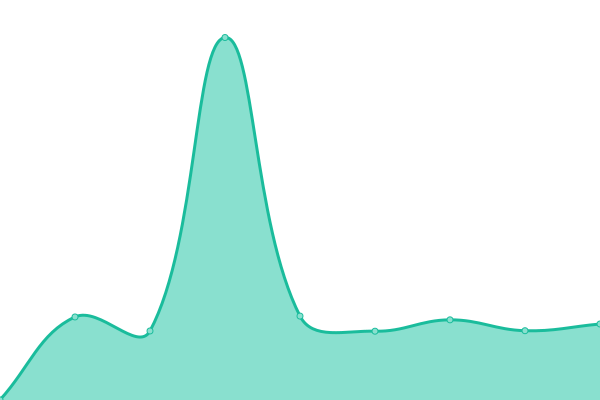

# [📈 Live Status](https://DataEnsta.github.io/upptime): <!--live status--> **🟧 Partial outage**

This repository contains the open-source uptime monitor and status page for [DaTA ENSTA](data-ensta.fr), powered by [Upptime](https://github.com/upptime/upptime).

With [Upptime](https://upptime.js.org), you can get your own unlimited and free uptime monitor and status page, powered entirely by a GitHub repository. We use [Issues](https://github.com/DataEnsta/upptime/issues) as incident reports, [Actions](https://github.com/DataEnsta/upptime/actions) as uptime monitors, and [Pages](https://DataEnsta.github.io/upptime) for the status page.

<!--start: status pages-->
<!-- This summary is generated by Upptime (https://github.com/upptime/upptime) -->
<!-- Do not edit this manually, your changes will be overwritten -->
<!-- prettier-ignore -->
| URL | Status | History | Response Time | Uptime |
| --- | ------ | ------- | ------------- | ------ |
|  [DaTA](https://data-ensta.fr) | 🟩 Up | [da-ta.yml](https://github.com/DataEnsta/upptime/commits/HEAD/history/da-ta.yml) | 

 1452ms
     
 | 

<a href="https://DataEnsta.github.io/upptime/history/da-ta">70.83%</a>
    

|  [Gitlab](https://gitlab.data-ensta.fr) | 🟩 Up | [gitlab.yml](https://github.com/DataEnsta/upptime/commits/HEAD/history/gitlab.yml) | 

 816ms
     
 | 

<a href="https://DataEnsta.github.io/upptime/history/gitlab">85.14%</a>
    

|  [ETAl](https://etal.data-ensta.fr) | 🟩 Up | [et-al.yml](https://github.com/DataEnsta/upptime/commits/HEAD/history/et-al.yml) | 

 815ms
     
 | 

<a href="https://DataEnsta.github.io/upptime/history/et-al">85.15%</a>
    

|  [Angry](https://angry.data-ensta.fr) | 🟥 Down | [angry.yml](https://github.com/DataEnsta/upptime/commits/HEAD/history/angry.yml) | 

 3119ms
     
 | 

<a href="https://DataEnsta.github.io/upptime/history/angry">50.60%</a>
    

|  [Bar](https://bar.data-ensta.fr) | 🟩 Up | [bar.yml](https://github.com/DataEnsta/upptime/commits/HEAD/history/bar.yml) | 

 821ms
     
 | 

<a href="https://DataEnsta.github.io/upptime/history/bar">85.15%</a>
    

|  [Bashupload](https://bashupload.data-ensta.fr) | 🟩 Up | [bashupload.yml](https://github.com/DataEnsta/upptime/commits/HEAD/history/bashupload.yml) | 

 844ms
     
 | 

<a href="https://DataEnsta.github.io/upptime/history/bashupload">85.16%</a>
    

|  [BDE](https://bde.data-ensta.fr) | 🟥 Down | [bde.yml](https://github.com/DataEnsta/upptime/commits/HEAD/history/bde.yml) | 

 775ms
     
 | 

<a href="https://DataEnsta.github.io/upptime/history/bde">100.00%</a>
    

|  [BDS](https://bds.data-ensta.fr) | 🟥 Down | [bds.yml](https://github.com/DataEnsta/upptime/commits/HEAD/history/bds.yml) | 

 729ms
     
 | 

<a href="https://DataEnsta.github.io/upptime/history/bds">100.00%</a>
    

|  [EnsTAir](https://enstair.data-ensta.fr) | 🟩 Up | [ens-t-air.yml](https://github.com/DataEnsta/upptime/commits/HEAD/history/ens-t-air.yml) | 

 619ms
     
 | 

<a href="https://DataEnsta.github.io/upptime/history/ens-t-air">85.17%</a>
    

|  [Etudes](https://etudes.data-ensta.fr) | 🟥 Down | [etudes.yml](https://github.com/DataEnsta/upptime/commits/HEAD/history/etudes.yml) | 

 2267ms
     
 | 

<a href="https://DataEnsta.github.io/upptime/history/etudes">50.74%</a>
    

|  [Flappy](https://flappy.data-ensta.fr) | 🟥 Down | [flappy.yml](https://github.com/DataEnsta/upptime/commits/HEAD/history/flappy.yml) | 

 2265ms
     
 | 

<a href="https://DataEnsta.github.io/upptime/history/flappy">50.64%</a>
    

|  [Gala](https://gala.data-ensta.fr) | 🟩 Up | [gala.yml](https://github.com/DataEnsta/upptime/commits/HEAD/history/gala.yml) | 

 1380ms
     
 | 

<a href="https://DataEnsta.github.io/upptime/history/gala">85.19%</a>
    

|  [Les lundis - DaTA](https://les-lundis.data-ensta.fr) | 🟩 Up | [les-lundis-da-ta.yml](https://github.com/DataEnsta/upptime/commits/HEAD/history/les-lundis-da-ta.yml) | 

 4207ms
     
 | 

<a href="https://DataEnsta.github.io/upptime/history/les-lundis-da-ta">70.89%</a>
    

|  [Les lundis - ENSTA](https://les-lundis.ensta-paris.fr) | 🟩 Up | [les-lundis-ensta.yml](https://github.com/DataEnsta/upptime/commits/HEAD/history/les-lundis-ensta.yml) | 

 1767ms
     
 | 

<a href="https://DataEnsta.github.io/upptime/history/les-lundis-ensta">70.80%</a>
    

|  [Markdown](https://markdown.data-ensta.fr) | 🟥 Down | [markdown.yml](https://github.com/DataEnsta/upptime/commits/HEAD/history/markdown.yml) | 

 2240ms
     
 | 

<a href="https://DataEnsta.github.io/upptime/history/markdown">50.76%</a>
    

|  [Palopedia](https://palopedia.data-ensta.fr) | 🟥 Down | [palopedia.yml](https://github.com/DataEnsta/upptime/commits/HEAD/history/palopedia.yml) | 

 651ms
     
 | 

<a href="https://DataEnsta.github.io/upptime/history/palopedia">50.77%</a>
    

|  [Parrainage](https://parrainage.data-ensta.fr) | 🟥 Down | [parrainage.yml](https://github.com/DataEnsta/upptime/commits/HEAD/history/parrainage.yml) | 

 3710ms
     
 | 

<a href="https://DataEnsta.github.io/upptime/history/parrainage">100.00%</a>
    

|  [Runner](https://runner.data-ensta.fr) | 🟥 Down | [runner.yml](https://github.com/DataEnsta/upptime/commits/HEAD/history/runner.yml) | 

 2335ms
     
 | 

<a href="https://DataEnsta.github.io/upptime/history/runner">50.69%</a>
    

|  [Staytuned](https://staytuned.data-ensta.fr) | 🟩 Up | [staytuned.yml](https://github.com/DataEnsta/upptime/commits/HEAD/history/staytuned.yml) | 

 567ms
     
 | 

<a href="https://DataEnsta.github.io/upptime/history/staytuned">85.21%</a>
    

|  [Tiny - DaTA](https://t.data-ensta.fr) | 🟥 Down | [tiny-da-ta.yml](https://github.com/DataEnsta/upptime/commits/HEAD/history/tiny-da-ta.yml) | 

 4396ms
     
 | 

<a href="https://DataEnsta.github.io/upptime/history/tiny-da-ta">100.00%</a>
    

|  [Tiny - ENSTA Paris](https://t.ensta-paris.fr) | 🟥 Down | [tiny-ensta-paris.yml](https://github.com/DataEnsta/upptime/commits/HEAD/history/tiny-ensta-paris.yml) | 

 2793ms
     
 | 

<a href="https://DataEnsta.github.io/upptime/history/tiny-ensta-paris">100.00%</a>
    

|  [Tiny - ENSTA](https://t.ensta.fr) | 🟥 Down | [tiny-ensta.yml](https://github.com/DataEnsta/upptime/commits/HEAD/history/tiny-ensta.yml) | 

 2789ms
     
 | 

<a href="https://DataEnsta.github.io/upptime/history/tiny-ensta">100.00%</a>
    

|  [Vote](https://vote.data-ensta.fr) | 🟩 Up | [vote.yml](https://github.com/DataEnsta/upptime/commits/HEAD/history/vote.yml) | 

 511ms
     
 | 

<a href="https://DataEnsta.github.io/upptime/history/vote">85.22%</a>
    

|  [Wiki](https://wiki.data-ensta.fr) | 🟩 Up | [wiki.yml](https://github.com/DataEnsta/upptime/commits/HEAD/history/wiki.yml) | 

 3106ms
     
 | 

<a href="https://DataEnsta.github.io/upptime/history/wiki">85.26%</a>
    

|  [WikiTA](https://wikita.data-ensta.fr) | 🟩 Up | [wiki-ta.yml](https://github.com/DataEnsta/upptime/commits/HEAD/history/wiki-ta.yml) | 

 2036ms
     
 | 

<a href="https://DataEnsta.github.io/upptime/history/wiki-ta">70.94%</a>
    

|  [Zeus](https://zeus.data-ensta.fr) | 🟩 Up | [zeus.yml](https://github.com/DataEnsta/upptime/commits/HEAD/history/zeus.yml) | 

 533ms
     
 | 

<a href="https://DataEnsta.github.io/upptime/history/zeus">85.27%</a>
    

<!--end: status pages-->

[**Visit our status website →**](https://DataEnsta.github.io/upptime)

## 📄 License

- Powered by: [Upptime](https://github.com/upptime/upptime)
- Code: [MIT](./LICENSE) © [DaTA ENSTA](data-ensta.fr)
- Data in the `./history` directory: [Open Database License](https://opendatacommons.org/licenses/odbl/1-0/)
