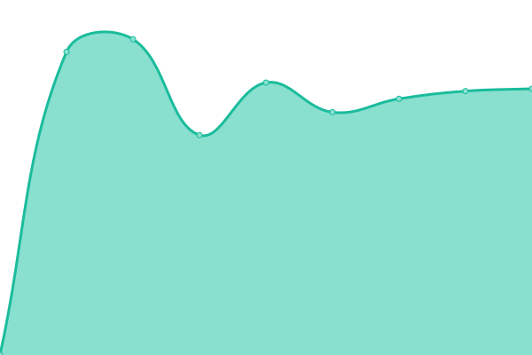

# [📈 Live Status](https://DataEnsta.github.io/upptime): <!--live status--> **🟧 Partial outage**

This repository contains the open-source uptime monitor and status page for [DaTA ENSTA](data-ensta.fr), powered by [Upptime](https://github.com/upptime/upptime).

With [Upptime](https://upptime.js.org), you can get your own unlimited and free uptime monitor and status page, powered entirely by a GitHub repository. We use [Issues](https://github.com/DataEnsta/upptime/issues) as incident reports, [Actions](https://github.com/DataEnsta/upptime/actions) as uptime monitors, and [Pages](https://DataEnsta.github.io/upptime) for the status page.

<!--start: status pages-->
<!-- This summary is generated by Upptime (https://github.com/upptime/upptime) -->
<!-- Do not edit this manually, your changes will be overwritten -->
<!-- prettier-ignore -->
| URL | Status | History | Response Time | Uptime |
| --- | ------ | ------- | ------------- | ------ |
|  [Aled](https://aled.data-ensta.fr) | 🟩 Up | [aled.yml](https://github.com/DataEnsta/upptime/commits/HEAD/history/aled.yml) | 

 1070ms
     
 | 

<a href="https://DataEnsta.github.io/upptime/history/aled">100.00%</a>
    

|  [Angry](https://angry.data-ensta.fr) | 🟩 Up | [angry.yml](https://github.com/DataEnsta/upptime/commits/HEAD/history/angry.yml) | 

 3509ms
     
 | 

<a href="https://DataEnsta.github.io/upptime/history/angry">97.25%</a>
    

|  [BDE](https://bde.ensta-paris.fr) | 🟩 Up | [bde.yml](https://github.com/DataEnsta/upptime/commits/HEAD/history/bde.yml) | 

 1646ms
     
 | 

<a href="https://DataEnsta.github.io/upptime/history/bde">97.25%</a>
    

|  [BDS](https://bds.ensta-paris.fr) | 🟥 Down | [bds.yml](https://github.com/DataEnsta/upptime/commits/HEAD/history/bds.yml) | 

 1304ms
     
 | 

<a href="https://DataEnsta.github.io/upptime/history/bds">100.00%</a>
    

|  [Bar](https://bar.data-ensta.fr) | 🟩 Up | [bar.yml](https://github.com/DataEnsta/upptime/commits/HEAD/history/bar.yml) | 

 2449ms
     
 | 

<a href="https://DataEnsta.github.io/upptime/history/bar">97.25%</a>
    

|  [Bashupload](https://bashupload.data-ensta.fr) | 🟩 Up | [bashupload.yml](https://github.com/DataEnsta/upptime/commits/HEAD/history/bashupload.yml) | 

 1151ms
     
 | 

<a href="https://DataEnsta.github.io/upptime/history/bashupload">97.25%</a>
    

|  [Best](https://best.data-ensta.fr) | 🟩 Up | [best.yml](https://github.com/DataEnsta/upptime/commits/HEAD/history/best.yml) | 

 877ms
     
 | 

<a href="https://DataEnsta.github.io/upptime/history/best">98.97%</a>
    

|  [Cascad](https://cascad.ensta.fr/login) | 🟩 Up | [cascad.yml](https://github.com/DataEnsta/upptime/commits/HEAD/history/cascad.yml) | 

 649ms
     
 | 

<a href="https://DataEnsta.github.io/upptime/history/cascad">100.00%</a>
    

|  [DaTA](https://data-ensta.fr) | 🟩 Up | [da-ta.yml](https://github.com/DataEnsta/upptime/commits/HEAD/history/da-ta.yml) | 

 1090ms
     
 | 

<a href="https://DataEnsta.github.io/upptime/history/da-ta">97.81%</a>
    

|  [ETAl](https://etal.data-ensta.fr) | 🟩 Up | [et-al.yml](https://github.com/DataEnsta/upptime/commits/HEAD/history/et-al.yml) | 

 2478ms
     
 | 

<a href="https://DataEnsta.github.io/upptime/history/et-al">97.24%</a>
    

|  [EnsTAgram](https://enstagram.data-ensta.fr) | 🟩 Up | [ens-t-agram.yml](https://github.com/DataEnsta/upptime/commits/HEAD/history/ens-t-agram.yml) | 

 1412ms
     
 | 

<a href="https://DataEnsta.github.io/upptime/history/ens-t-agram">97.85%</a>
    

|  [EnsTAgram - Drive](https://enstagram-drive.data-ensta.fr) | 🟩 Up | [ens-t-agram-drive.yml](https://github.com/DataEnsta/upptime/commits/HEAD/history/ens-t-agram-drive.yml) | 

 474ms
     
 | 

<a href="https://DataEnsta.github.io/upptime/history/ens-t-agram-drive">100.00%</a>
    

|  [EnsTAir](https://enstair.data-ensta.fr) | 🟩 Up | [ens-t-air.yml](https://github.com/DataEnsta/upptime/commits/HEAD/history/ens-t-air.yml) | 

 2301ms
     
 | 

<a href="https://DataEnsta.github.io/upptime/history/ens-t-air">97.26%</a>
    

|  [EnTAblier](https://entablier.data-ensta.fr) | 🟩 Up | [en-t-ablier.yml](https://github.com/DataEnsta/upptime/commits/HEAD/history/en-t-ablier.yml) | 

 1052ms
     
 | 

<a href="https://DataEnsta.github.io/upptime/history/en-t-ablier">98.97%</a>
    

|  [Etudes](https://etudes.data-ensta.fr) | 🟩 Up | [etudes.yml](https://github.com/DataEnsta/upptime/commits/HEAD/history/etudes.yml) | 

 765ms
     
 | 

<a href="https://DataEnsta.github.io/upptime/history/etudes">97.86%</a>
    

|  [Flappy](https://flappy.data-ensta.fr) | 🟩 Up | [flappy.yml](https://github.com/DataEnsta/upptime/commits/HEAD/history/flappy.yml) | 

 2876ms
     
 | 

<a href="https://DataEnsta.github.io/upptime/history/flappy">97.19%</a>
    

|  [Gala](https://gala.data-ensta.fr) | 🟩 Up | [gala.yml](https://github.com/DataEnsta/upptime/commits/HEAD/history/gala.yml) | 

 2324ms
     
 | 

<a href="https://DataEnsta.github.io/upptime/history/gala">97.79%</a>
    

|  [Gitlab](https://gitlab.data-ensta.fr) | 🟩 Up | [gitlab.yml](https://github.com/DataEnsta/upptime/commits/HEAD/history/gitlab.yml) | 

 803ms
     
 | 

<a href="https://DataEnsta.github.io/upptime/history/gitlab">97.51%</a>
    

|  [Les lundis - DaTA](https://les-lundis.data-ensta.fr) | 🟩 Up | [les-lundis-da-ta.yml](https://github.com/DataEnsta/upptime/commits/HEAD/history/les-lundis-da-ta.yml) | 

 1297ms
     
 | 

<a href="https://DataEnsta.github.io/upptime/history/les-lundis-da-ta">79.88%</a>
    

|  [Les lundis - ENSTA](https://les-lundis.ensta-paris.fr) | 🟥 Down | [les-lundis-ensta.yml](https://github.com/DataEnsta/upptime/commits/HEAD/history/les-lundis-ensta.yml) | 

 1174ms
     
 | 

<a href="https://DataEnsta.github.io/upptime/history/les-lundis-ensta">62.35%</a>
    

|  [Markdown](https://markdown.data-ensta.fr) | 🟩 Up | [markdown.yml](https://github.com/DataEnsta/upptime/commits/HEAD/history/markdown.yml) | 

 931ms
     
 | 

<a href="https://DataEnsta.github.io/upptime/history/markdown">97.81%</a>
    

|  [Palopedia](https://palopedia.data-ensta.fr) | 🟩 Up | [palopedia.yml](https://github.com/DataEnsta/upptime/commits/HEAD/history/palopedia.yml) | 

 958ms
     
 | 

<a href="https://DataEnsta.github.io/upptime/history/palopedia">97.19%</a>
    

|  [Pong](https://pong.data-ensta.fr) | 🟩 Up | [pong.yml](https://github.com/DataEnsta/upptime/commits/HEAD/history/pong.yml) | 

 1338ms
     
 | 

<a href="https://DataEnsta.github.io/upptime/history/pong">98.70%</a>
    

|  [Runner](https://runner.data-ensta.fr) | 🟩 Up | [runner.yml](https://github.com/DataEnsta/upptime/commits/HEAD/history/runner.yml) | 

 2846ms
     
 | 

<a href="https://DataEnsta.github.io/upptime/history/runner">97.19%</a>
    

|  [Staytuned](https://staytuned.data-ensta.fr) | 🟩 Up | [staytuned.yml](https://github.com/DataEnsta/upptime/commits/HEAD/history/staytuned.yml) | 

 2258ms
     
 | 

<a href="https://DataEnsta.github.io/upptime/history/staytuned">97.20%</a>
    

|  Technimage | 🟩 Up | [technimage.yml](https://github.com/DataEnsta/upptime/commits/HEAD/history/technimage.yml) | 

 723ms
     
 | 

<a href="https://DataEnsta.github.io/upptime/history/technimage">97.86%</a>
    

|  [Tiny - DaTA](https://t.data-ensta.fr) | 🟥 Down | [tiny-da-ta.yml](https://github.com/DataEnsta/upptime/commits/HEAD/history/tiny-da-ta.yml) | 

 1577ms
     
 | 

<a href="https://DataEnsta.github.io/upptime/history/tiny-da-ta">100.00%</a>
    

|  [Tiny - ENSTA Paris](https://t.ensta-paris.fr) | 🟥 Down | [tiny-ensta-paris.yml](https://github.com/DataEnsta/upptime/commits/HEAD/history/tiny-ensta-paris.yml) | 

 119ms
     
 | 

<a href="https://DataEnsta.github.io/upptime/history/tiny-ensta-paris">100.00%</a>
    

|  [Tiny - ENSTA](https://t.ensta.fr) | 🟥 Down | [tiny-ensta.yml](https://github.com/DataEnsta/upptime/commits/HEAD/history/tiny-ensta.yml) | 

 947ms
     
 | 

<a href="https://DataEnsta.github.io/upptime/history/tiny-ensta">100.00%</a>
    

|  [Vote](https://vote.data-ensta.fr) | 🟩 Up | [vote.yml](https://github.com/DataEnsta/upptime/commits/HEAD/history/vote.yml) | 

 2219ms
     
 | 

<a href="https://DataEnsta.github.io/upptime/history/vote">97.20%</a>
    

|  [Wiki](https://wiki.data-ensta.fr) | 🟩 Up | [wiki.yml](https://github.com/DataEnsta/upptime/commits/HEAD/history/wiki.yml) | 

 2359ms
     
 | 

<a href="https://DataEnsta.github.io/upptime/history/wiki">97.21%</a>
    

|  [WikiTA](https://wikita.data-ensta.fr) | 🟩 Up | [wiki-ta.yml](https://github.com/DataEnsta/upptime/commits/HEAD/history/wiki-ta.yml) | 

 1111ms
     
 | 

<a href="https://DataEnsta.github.io/upptime/history/wiki-ta">97.21%</a>
    

|  [Zeus](https://zeus.data-ensta.fr) | 🟩 Up | [zeus.yml](https://github.com/DataEnsta/upptime/commits/HEAD/history/zeus.yml) | 

 699ms
     
 | 

<a href="https://DataEnsta.github.io/upptime/history/zeus">81.22%</a>
    

<!--end: status pages-->

[**Visit our status website →**](https://DataEnsta.github.io/upptime)

## 📄 License

- Powered by: [Upptime](https://github.com/upptime/upptime)
- Code: [MIT](./LICENSE) © [DaTA ENSTA](data-ensta.fr)
- Data in the `./history` directory: [Open Database License](https://opendatacommons.org/licenses/odbl/1-0/)
